# JSON data sorting task.

This is a single-page website, that reads JSON file, processes it, and stores vehicle data in the database.
Laravel is used as a framework, together with vue.js and Axios to make an HTTP request to the backend without page refresh. 
Vehicles are sorted in columns depending on data fetched from the database. Max allowed rows are 14. 
Each vehicle can be edited and moved from one column to another. Vehicles, where s_datums value is null
can be removed from the table. 
    
 Please follow instructions below to run it on your local environment.

    Open terminal within a folder, were you want to download this project.
    Enter command "git clone https://github.com/JanisDavidsons/csdd.git ."

   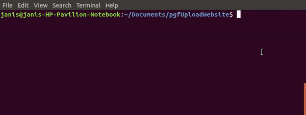

    Install Composer Dependencies.
    "composer install"

   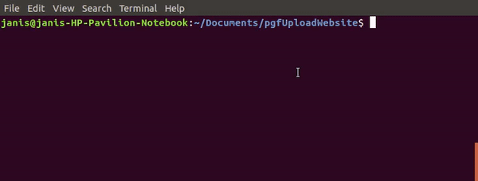

    Install NPM Dependencies.
    "npm install"
    
   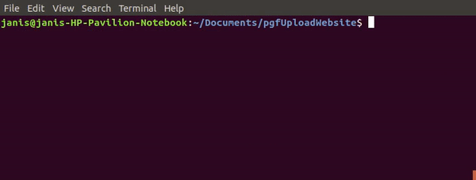

    Create a copy of your .env file.
    "cp .env.example .env"
    
   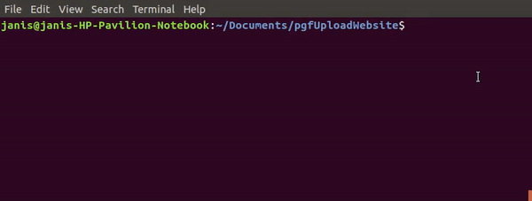

    Generate an app encryption key.
    "php artisan key:generate"
    
   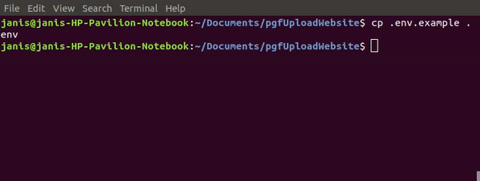

    Create new file in databse folder with command "touch database.sqlite"
    You can use any database, but in this example I`m using sqlite.
    
   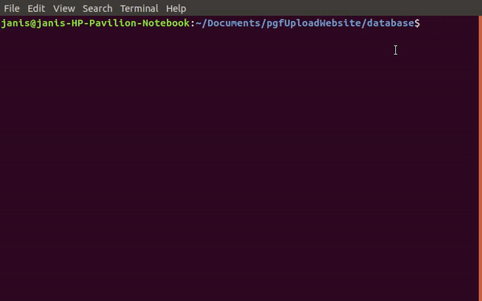

     In the .env file, add database information to allow Laravel to connect to the database.  
     Leave only this part in database section "DB_CONNECTION=sqlite"  

   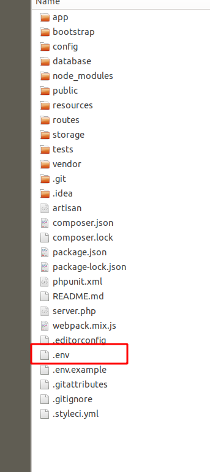
   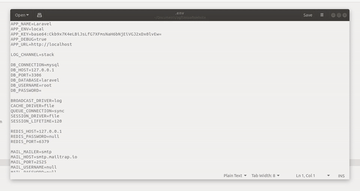

    Migrate the database
   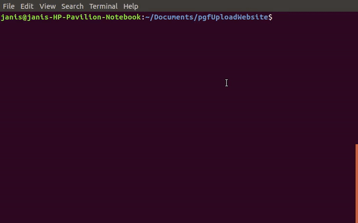
   
    Run local server with command "php artisan serve"
    Open adress displayed in terminal!
   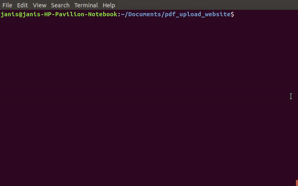
       
Sample of the project:

   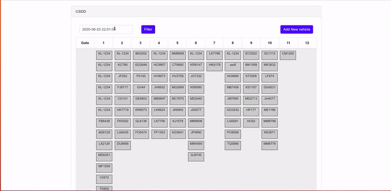
   
    https://youtu.be/9lV6NrncEDA
